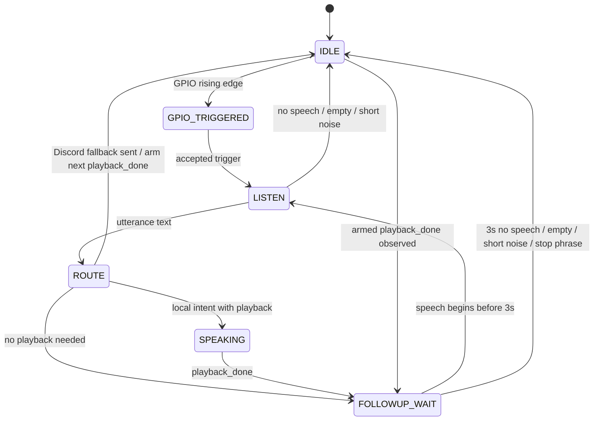

# Continuous Wake Conversation Spec

Date: 2026-05-06
Status: Draft for review

## Objective

Roamer should support a continuous hands-free conversation loop after SU-03T wake.
The user should be able to say a wake phrase once, ask a question, hear Roamer's
answer, then ask the next question without repeating the wake phrase.

The main problem to solve is not Discord fallback itself. The problem is that wake,
listen, route, speak, and follow-up are currently coupled loosely enough that Roamer
can keep listening while it is speaking, and follow-up can be extended by noise.

## Assumptions

- `roamer-wake.service` and `roamer-serve.service` are separate processes.
- External replies, including Discord/OpenClaw responses, can call `roamer speak`
  through the serve daemon or CLI.
- Wake must continue to use SU-03T GPIO as the low-power idle trigger.
- Continuous conversation is required now, not a later enhancement.
- `followup_timeout_sec` is 3.0 seconds.
- `endpoint.silence_sec` is 1.5 seconds and only means "utterance end after speech";
  it is not the same as follow-up idle timeout.

## Target Flow

There are two ways to reach listening:

- GPIO starts a new wake session from `IDLE`.
- An armed `playback_done` event opens `FOLLOWUP_WAIT(3s)`; user speech inside that
  window starts the next `LISTEN`.

`playback_done` does not directly call wake and does not immediately record audio. It
only makes the follow-up window available.

```text
IDLE
  -> GPIO_TRIGGERED
  -> LISTEN
  -> ROUTE
  -> SPEAKING_OR_IDLE
  -> FOLLOWUP_WAIT
  -> LISTEN
  -> ROUTE
  -> ...
  -> IDLE
```

Example:

```text
User: "理查德，现在几点了"
Roamer: "现在是 20:35"
User: "明天天气呢"
Roamer: answers through local intent or Discord/OpenClaw
User says nothing for 3 seconds
Roamer returns to IDLE and waits for SU-03T again
```

For Discord/OpenClaw fallback, wake must not block while the LLM is thinking:

```text
ROUTE sends Discord fallback
  -> arm follow-up after next playback_done
  -> return to IDLE immediately

Later:
external roamer speak starts and finishes
  -> playback_done event
  -> FOLLOWUP_WAIT(3s)
```

## Current Problems

1. Follow-up does not have hard exit conditions.
   `speech.vad.no_speech`, empty transcript, and single-character ASR currently do
   not reliably close the follow-up state.

2. Wake can listen while Roamer is speaking.
   Local intent speaking is synchronous, but external `roamer speak` calls happen in
   another process. Wake cannot see that playback is active today.

3. Follow-up timing starts from routing decisions, not from playback completion.
   For a spoken assistant, the useful follow-up window starts when Roamer finishes
   talking, not when route processing begins.

4. The fallback route can amplify the lifecycle problem.
   If wake keeps listening during playback or noisy follow-up, Discord fallback can
   turn those fragments into more playback and more captured fragments.

## Architecture

Add a small cross-process playback state shared by wake and speak:

```text
SpeakCapability
  -> PlaybackState.mark_started()
  -> audio.play(...)
  -> PlaybackState.mark_finished()

WakeCapability
  -> does not listen while playback is active
  -> can arm "enter follow-up after next playback_done"
  -> returns to IDLE instead of waiting for slow external replies
```

This is deliberately not a plugin-to-plugin callback. `SpeakCapability` does not call
`WakeCapability`, and wake does not depend on speak internals. Speak publishes playback
facts; wake observes those facts when it is armed.

Use files under `/run/roamer` because both systemd services can access them and the
state should not survive reboot:

```text
/run/roamer/playback.d/<playback_id>.json
/run/roamer/playback.json
```

Each file under `playback.d/` is an active playback marker owned by one
`roamer speak` process. Wake treats playback as active when at least one non-stale
marker exists. `playback.json` is diagnostic aggregate state:

```json
{
  "active": true,
  "active_count": 1,
  "playback_id": "def456",
  "request_id": "abc123",
  "source": "speak",
  "text_hash": "optional-redacted-id",
  "pid": 1234,
  "started_at": "2026-05-06T20:35:00.000+08:00",
  "finished_at": null,
  "generation": 42
}
```

`SpeakCapability` must always clear the active state in `finally`, even when playback
fails. Each speak clears only its own marker. Playback completion increments
`generation` when the active marker count transitions from non-zero to zero; wake
consumes generation changes to open follow-up when it has previously armed
follow-up-after-playback.

This keeps LLM latency out of the wake loop. If a Discord/OpenClaw reply takes 30 seconds,
wake is still in `IDLE` and can accept a new SU-03T trigger. If no reply ever arrives,
nothing is stuck.

## State Machine



## Follow-Up Rules

Follow-up starts only in these cases:

- Wake phrase only: any configured wake phrase with no command text, such as
  `richard`, `rich erd`, `瑞彻德`, or `理查德`.
- Local intent finished and playback is done
- External playback finished after wake armed follow-up-after-playback
- A route completed without playback but was a valid command

Follow-up exits immediately in these cases:

- `speech.vad.no_speech`
- empty transcript
- single-character ASR such as `嗯。`, `啊！`, `是。`, `走。`
- stop phrase: `不用了`, `结束`, `停止`, `可以了`
- `followup_timeout_sec` expires before speech starts
- max continuous turns reached

Follow-up must not be refreshed by:

- ignored route
- empty transcript
- single-character ASR
- playback captured by microphone

Ignored branches never enter follow-up. `wake_phrase_only` should be logged as
`wake.followup_start reason=wake_phrase_only`, not as `route_ignored`, because it is a
valid wake without command text.

## Listening Rules

Wake must not record while playback is active.

Before every listen attempt:

```text
if playback_state.active:
  log wake.listen_skipped_while_speaking
  stay idle until playback is no longer active
```

When a Discord fallback is sent, wake arms a lightweight pending playback follow-up
marker and returns to `IDLE`:

```json
{
  "armed": true,
  "session_id": "802330d02eec",
  "turn_id": 3,
  "after_generation": 42
}
```

Wake should check the playback generation before blocking on GPIO. If `armed=true`
and `playback.generation > after_generation`, consume the marker and enter
`FOLLOWUP_WAIT(3s)`. If the user triggers SU-03T again before playback happens, the
new wake interaction supersedes the armed marker.

MVP correlation rule: an armed playback follow-up is consumed by the next completed
`roamer speak` generation. Exact `session_id` / `turn_id` correlation is not required
for the first implementation.

Implementation note: normal `IDLE` can still block indefinitely on GPIO. Only when
`armed=true` does wake need to multiplex "GPIO edge or playback_done". The simplest
implementation can use a short quiet check interval while armed, without logging every
poll. A later implementation can replace that with inotify.

For follow-up listening, the no-speech timeout must be bounded by the remaining
follow-up window. With `followup_timeout_sec = 3.0`, wake should not spend 10 seconds
inside endpointing waiting for speech.

Implementation detail:

```python
followup_remaining = self._followup_until - self._clock()
endpoint_config = replace(
    endpoint_config,
    no_speech_timeout_sec=min(endpoint_config.no_speech_timeout_sec, followup_remaining),
)
```

## Routing Rules

During the initial wake-triggered utterance:

- If ASR matches a configured wake phrase, strip it and route the command.
- If ASR does not match a wake phrase but matches a local intent, allow the local intent.
  This handles ASR variants such as `车的，现在几点了？`.
- If ASR does not match a wake phrase and does not match a local intent, ignore it.
- Discord fallback requires either a matched wake phrase or an active follow-up.

During follow-up:

- Local intent may run.
- Discord fallback may run, but it must arm follow-up-after-playback and return to
  `IDLE`; it cannot refresh follow-up immediately.
- Ignored text exits or lets the 3-second window expire; it does not refresh.

## Configuration

Add explicit continuous conversation settings:

```yaml
converse:
  wakeword:
    followup_timeout_sec: 3.0
    continuous_followup_enabled: true
    max_followup_turns: 3
    stop_phrases:
      - 不用了
      - 结束
      - 停止
      - 可以了

runtime:
  state_dir: /run/roamer
  playback_stale_after_sec: 120.0
```

No external playback wait timeout is required because wake does not wait in the route
path. It returns to `IDLE` immediately and reacts only if a later `playback_done`
event arrives.

## Logging

Keep these events at `INFO`:

```text
wake.followup_start
wake.followup_refresh
wake.followup_exit
wake.followup_armed_after_playback
wake.followup_disarmed
wake.listen_skipped_while_speaking
wake.playback_done_observed
speak.play_start
speak.play_done
speak.playback
```

Expected fields:

- `session_id`
- `turn_id`
- `reason`
- `in_followup`
- `remaining_sec`
- `playback_generation`
- `armed_after_generation`
- `duration_ms`

Endpoint internals remain `DEBUG`.

## File Changes

Expected implementation files:

```text
src/roamer/platform/config.py
src/roamer/plugins/interaction/capabilities/speak.py
src/roamer/plugins/interaction/capabilities/wake.py
src/roamer/plugins/interaction/services/playback_state.py
tests/plugins/interaction/test_playback_state.py
tests/plugins/interaction/test_speak_playback_state.py
tests/plugins/interaction/test_wake_capability.py
tests/plugins/interaction/test_runtime_logging.py
config.yaml
config.example.yaml
```

## Test Strategy

Unit tests:

- `PlaybackState` marks active during playback and clears in `finally`.
- `PlaybackState` can be read across separate instances using the same state dir.
- Wake does not call `_listen_once` while playback is active.
- Wake enters follow-up after playback finishes.
- Wake returns to IDLE immediately after Discord fallback and does not wait for playback.
- Armed playback follow-up is consumed when a later playback generation completes.
- A new GPIO trigger supersedes an armed playback follow-up marker.
- Follow-up exits on `speech.vad.no_speech`.
- Follow-up exits on empty transcript.
- Follow-up exits on single-character ASR and does not refresh.
- Local intent can route after GPIO trigger even when wake phrase ASR is imperfect.
- Discord fallback arms playback follow-up, returns to IDLE, and does not immediately listen.

Integration-style tests:

- Local intent: wake phrase -> time intent -> speak -> follow-up -> second command.
- External response: wake phrase -> Discord fallback -> IDLE -> external speak -> follow-up.
- No response: wake phrase -> Discord fallback -> IDLE, no blocked wait.

Manual Roamer checks:

```bash
systemctl status roamer-wake.service roamer-serve.service
tail -f logs/roamer.log | grep -E '"event":"(followup_|playback_|listen_skipped|route_|asr_transcript|play_)'
```

Scenarios:

1. Say `理查德，现在几点了`; after Roamer finishes speaking, say `明天呢`.
2. Say only `理查德`; stay silent. Roamer should return to GPIO wait within about 3s.
3. Say `理查德`; let Discord/OpenClaw reply slowly through `roamer speak`; speak again after playback.
4. During Roamer playback, make noise near the microphone. Wake should not ASR it.
5. Say `不用了` during follow-up. Roamer should exit to IDLE.

## Success Criteria

- No wake ASR occurs while `speak.play_start` to `speak.play_done` is active.
- The follow-up window starts after playback completion.
- Follow-up exits within 3 seconds when the user says nothing.
- Empty transcript and single-character ASR do not refresh follow-up.
- Continuous local intent conversation works for at least 3 turns.
- External Discord/OpenClaw spoken replies can continue the conversation after playback.
- Slow or missing LLM replies do not block wake from returning to IDLE.
- Logs explain every important branch without requiring DEBUG endpoint logs.

## Decisions

- Armed playback follow-up is consumed by the next completed `roamer speak` generation.
  Exact `session_id` / `turn_id` correlation can be added later if field testing shows
  false follow-up windows.
- Discord fallback is allowed during follow-up for multi-character text after local
  intent miss, but fallback immediately returns wake to `IDLE` and only arms the next
  playback completion.
- `max_followup_turns` defaults to 3 for field testing.
- Ignored routes never enter or refresh follow-up.
- `speak_done` is observed through playback generation; speak never directly invokes
  wake.
- The installer owns creation of `/run/roamer` via systemd-tmpfiles; neither
  `roamer-serve.service` nor `roamer-wake.service` owns the shared directory with
  `RuntimeDirectory`.
- Wake treats old playback markers as stale so a killed CLI playback process cannot
  permanently block listening.
